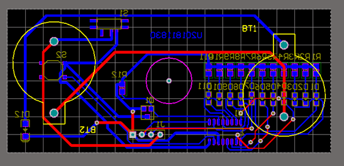

# 电子工艺  第2讲：PCB设计 
## 	1.课堂任务报告
   
 *PCB图*  
 课堂任务及作品截图如上
 ## 2.课后作业
 ### 1.PCB设计过程中，各个工作层的主要功能是什么？
 Top Layer：顶层，一般作为元件层。设计单面板时，元件层是不能布线的。双面板中的元件层则可以布线。 
Bottom Layer：焊接层，在单面板中焊接层是惟一可以布线的工作层。   
Mechanical Layer（机械层）：一般用于放置有关制版和装配方法的信息。 
Top overlay和bottom overlay：是定义顶层和底的丝印字符，就是一般我们在PCB板上看到的元件编号和一些字符。
Top Solder：元件面阻焊层。 
Bottom Solder：焊接面阻焊层。 
Top Paste：元件面锡焊膏层。 
Bottom Paste：焊接面焊锡膏层。 
Drill Guide：钻孔位置层，主要用于绘制钻孔图。 
Keep-Out Layer：禁止布线层。可用于自定义截取所需板子
Drill Drawing：钻孔层，用于指定钻孔位置。
Multi-Layer：多层，表示所有的信号层，在它上面放置的元件会自动放到所有的信号层上。所以在设计工作中，可以通过该层将焊盘或穿透式过孔快速地放置到所有的信号层上。
### 2. 设计规则检查Design Rule Check(DRC)的作用是什么？在PCB板的设计过程中，是否随时在进行DRC检查？自动布线前，是否必须把设计规则设置好？
Design Rule Check(DRC)可以确保你的版图设计是工艺可靠的，能够顺利出产
系统随时在进行DRC检查。
自动布线前，必须把设计规则设置。

 